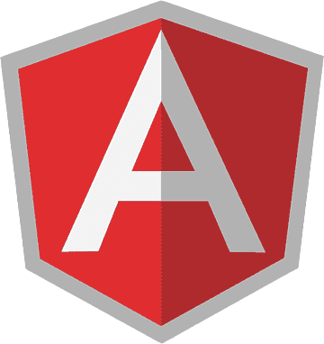

##  Akinsola Temidayo

####  
](https://git.io/typing-svg)](https://scontent.fabb1-2.fna.fbcdn.net/v/t39.30808-6/358414473_238300615816056_5151778658447856135_n.jpg?stp=dst-jpg_s960x960&_nc_cat=100&ccb=1-7&_nc_sid=783fdb&_nc_eui2=AeHR7N1vU-sxyrcMf8hAtwa_nbBpRoVUcbKdsGlGhVRxssyyPJ0ia4GLegbNLzeZxAnmvpAzogpvSjlvlK3aUNxH&_nc_ohc=PyPikahFOxQAX8kNEK5&_nc_zt=23&_nc_ht=scontent.fabb1-2.fna&oh=00_AfDw4Mn0QCk7AUUk9F-PPDcVCT686UiN93m6kYVQFxVTaA&oe=6577669C)

I'm  passionate web developer with a knack for crafting exceptional digital experiences. When I'm not immersed in code, you can find me curating and sharing fascinating tech content on my Facebook page(https://www.facebook.com/Owolabi_Code's), where I run a tech brand. Join me on this coding journey, and let's learn amazing tricks and tips.💻✨   Currently working on <a href="https://github.com/AkinsolaTemidayo/Employee_dashboard ">Employee_dashboard:</a> a centralized platform for managing employee-related tasks, schedules, and performance metrics. It's designed to streamline HR processes, enhance communication, and provide valuable insights for efficient workforce management.

##  Tools and Languages  
              

##  Contact me
 

    
